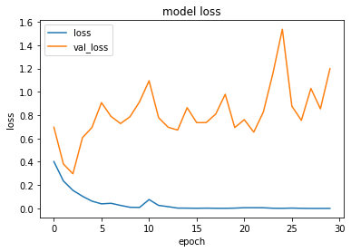
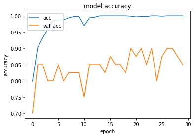
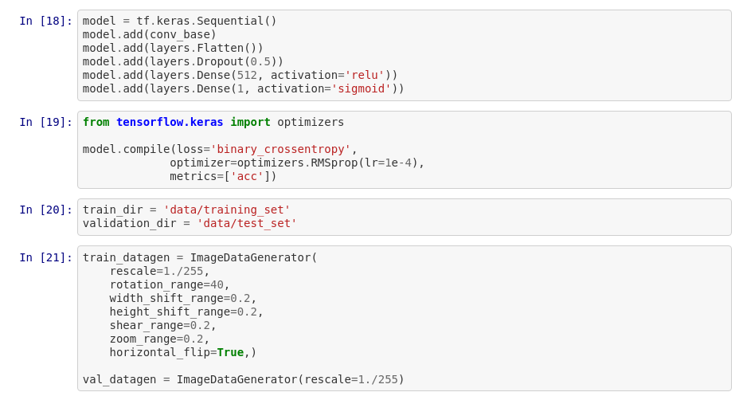
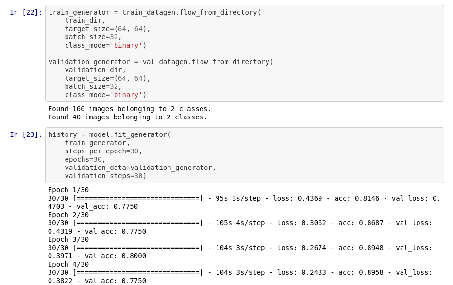
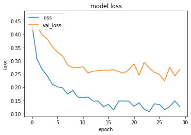

[Home](https://mgcodesandstats.github.io/) |
[Portfolio](https://mgcodesandstats.github.io/portfolio/) |
[Terms and Conditions](https://mgcodesandstats.github.io/terms/) |
[E-mail me](mailto:contact@michaeljgrogan.com) |
[LinkedIn](https://www.linkedin.com/in/michaeljgrogan/)

# Image Recognition with Keras: Convolutional Neural Networks

Image recognition and classification is a rapidly growing field in the area of machine learning. In particular, object recognition is a key feature of image classification, and the commercial implications of this are vast.

For instance, image classifiers will increasingly be used to:

- Replace passwords with facial recognition
- Allow autonomous vehicles to detect obstructions
- Identify geographical features from satellite imagery

These are just a few of many examples of how image classification will ultimately shape the future of the world we live in.

So, let’s take a look at an example of how we can build our own image classifier.

## Our Task

The purpose is to build a classifier that can distinguish between an image of a **car** vs. an image of a **plane**.

To do this, 80 images for each class are used for the training set, 20 images are used for the validation set, and then 15 images in total are used for the test set (or the unseen images which are used for gauging prediction accuracy). The image sets were collated independently using open-source images from the Pixabay and Unsplash websites.

**Car - Sample Image**


**Plane - Sample Image**


## Configuring the CNN (Convolutional Neural Network)

A sequential neural network with input shape (64, 64, 3) is configured:

```
# Configure the CNN (Convolutional Neural Network).

classifier = Sequential()

# Convolution - extracting appropriate features from the input image.
# Non-Linearity (RELU) - replacing all negative pixel values in feature map by zero.

classifier.add(Conv2D(32, (3, 3), input_shape=(64, 64, 3),
               activation='relu'))

# Pooling: reduces dimensionality of the feature maps but keeps the most important information.

classifier.add(MaxPooling2D(pool_size=(2, 2)))

# Adding a second convolutional layer and flattening in order to arrange 3D volumes into a 1D vector.

classifier.add(Conv2D(32, (3, 3), activation='relu'))
classifier.add(MaxPooling2D(pool_size=(2, 2)))
classifier.add(Flatten())

# Fully connected layers: ensures connections to all activations in the previous layer.

classifier.add(Dense(units=128, activation='relu'))
classifier.add(Dense(units=1, activation='sigmoid'))
```

The classifier is then trained using the **binary crossentropy** loss function and **adam** optimizer.

```
# Compile the CNN and train the classifier..

classifier.compile(optimizer='adam', loss='binary_crossentropy',
                   metrics=['accuracy'])
from keras.preprocessing.image import ImageDataGenerator
train_imagedata = ImageDataGenerator(rescale=1. / 255, shear_range=0.2,
        zoom_range=0.2, horizontal_flip=True)
test_imagedata = ImageDataGenerator(rescale=1. / 255)
training_set = \
    train_imagedata.flow_from_directory('data/training_set'
        , target_size=(64, 64), batch_size=32, class_mode='binary')
test_set = \
    test_imagedata.flow_from_directory('data/test_set'
        , target_size=(64, 64), batch_size=32, class_mode='binary')
history=classifier.fit_generator(training_set, steps_per_epoch=30, epochs=30,
                         validation_data=test_set,
                         validation_steps=30)
```

Here are the results:

```
Found 160 images belonging to 2 classes.
Found 40 images belonging to 2 classes.
Epoch 1/30
30/30 [==============================] - 39s 1s/step - loss: 0.4017 - accuracy: 0.7990 - val_loss: 0.6963 - val_accuracy: 0.7000
Epoch 2/30
30/30 [==============================] - 38s 1s/step - loss: 0.2355 - accuracy: 0.9021 - val_loss: 0.3809 - val_accuracy: 0.8500
...
Epoch 29/30
30/30 [==============================] - 37s 1s/step - loss: 3.5012e-04 - accuracy: 1.0000 - val_loss: 0.8540 - val_accuracy: 0.8750
Epoch 30/30
30/30 [==============================] - 38s 1s/step - loss: 5.9506e-04 - accuracy: 1.0000 - val_loss: 1.1977 - val_accuracy: 0.8500
```

As we can see, we have achieved roughly an 80-85% accuracy range. However, the model loss is also increasing as we increase the number of epochs.

**Model Loss**



**Model Accuracy**



This suggests an issue with overfitting - given that a relatively small sample size was used to train the model. This will lead to a situation whereby the model performs strongly on classifying training data, but poorly on classifying unseen data.

## Preventing overfitting: Using a pretrained network

In a situation where not enough images exist for an effective sample size, one option is to use a pretrained network. In this example, VGG16 is used; which comes prepackaged with Keras.

Essentially, this pretrained network is one that will previously have been trained on a large image database, and thus the weights of the VGG16 network are appropriately optimized for classification purposes. In this regard, VGG16 can be used in conjunction with the existing training data to improve the classification of the model.

Using classification weights trained on the **imagenet** database, the model can be trained. Additionally, note that ```conv_base.trainable``` is set to **False**, in order to freeze the weights; i.e. prevent them from updating during training.

Here is a summary of the model:

```

Model: "vgg16"
_________________________________________________________________
Layer (type)                 Output Shape              Param #   
=================================================================
input_1 (InputLayer)         [(None, 64, 64, 3)]       0         
_________________________________________________________________
block1_conv1 (Conv2D)        (None, 64, 64, 64)        1792      
_________________________________________________________________
block1_conv2 (Conv2D)        (None, 64, 64, 64)        36928     
_________________________________________________________________
block1_pool (MaxPooling2D)   (None, 32, 32, 64)        0         
_________________________________________________________________
block2_conv1 (Conv2D)        (None, 32, 32, 128)       73856     
_________________________________________________________________
block2_conv2 (Conv2D)        (None, 32, 32, 128)       147584    
_________________________________________________________________
block2_pool (MaxPooling2D)   (None, 16, 16, 128)       0         
_________________________________________________________________
block3_conv1 (Conv2D)        (None, 16, 16, 256)       295168    
_________________________________________________________________
block3_conv2 (Conv2D)        (None, 16, 16, 256)       590080    
_________________________________________________________________
block3_conv3 (Conv2D)        (None, 16, 16, 256)       590080    
_________________________________________________________________
block3_pool (MaxPooling2D)   (None, 8, 8, 256)         0         
_________________________________________________________________
block4_conv1 (Conv2D)        (None, 8, 8, 512)         1180160   
_________________________________________________________________
block4_conv2 (Conv2D)        (None, 8, 8, 512)         2359808   
_________________________________________________________________
block4_conv3 (Conv2D)        (None, 8, 8, 512)         2359808   
_________________________________________________________________
block4_pool (MaxPooling2D)   (None, 4, 4, 512)         0         
_________________________________________________________________
block5_conv1 (Conv2D)        (None, 4, 4, 512)         2359808   
_________________________________________________________________
block5_conv2 (Conv2D)        (None, 4, 4, 512)         2359808   
_________________________________________________________________
block5_conv3 (Conv2D)        (None, 4, 4, 512)         2359808   
_________________________________________________________________
block5_pool (MaxPooling2D)   (None, 2, 2, 512)         0         
=================================================================
Total params: 14,714,688
Trainable params: 0
Non-trainable params: 14,714,688
```

The Sequential model is defined, with Dropout introduced to further reduce overfitting, and the training and validation directories are defined.



The train and validation generators are defined, and the model is trained over 30 epochs:



Let's take a look at the model loss and accuracy:

**Model Loss**



**Model Accuracy**


We can see that the validation accuracy has remained more or less the same, while the model loss has improved greatly. This indicates that the model is now less likely to overfit than previously.

## Testing against unseen data

The next step is to now test the prediction accuracy of the model against unseen data or test data (i.e. images that have not been used in either the training or validation sets).


With an accuracy of 80% against the test set, we can see that the model has shown success in predicting against unseen images.

# Conclusion

In this example, we have seen:

- How to configure a convolutional neural network
- Reduce overfitting through use of VGG16 and imagenet
- Formulate predictions on a test set to gauge model accuracy

We have seen that reasonably high levels of accuracy were generated when using a relatively small sample size in conjunction with a VGG16 network. With that being said, the images presented in this example are more on the simplistic side. If we were trying to build a model for face recognition, chances are that a much larger sample size would be needed to account for the greater levels of complexity in the features that would be observed across such images.

That said, depending on the type of images under analysis, it is possible to obtain respectable results with a small sample size when combined with a pretrained network.
